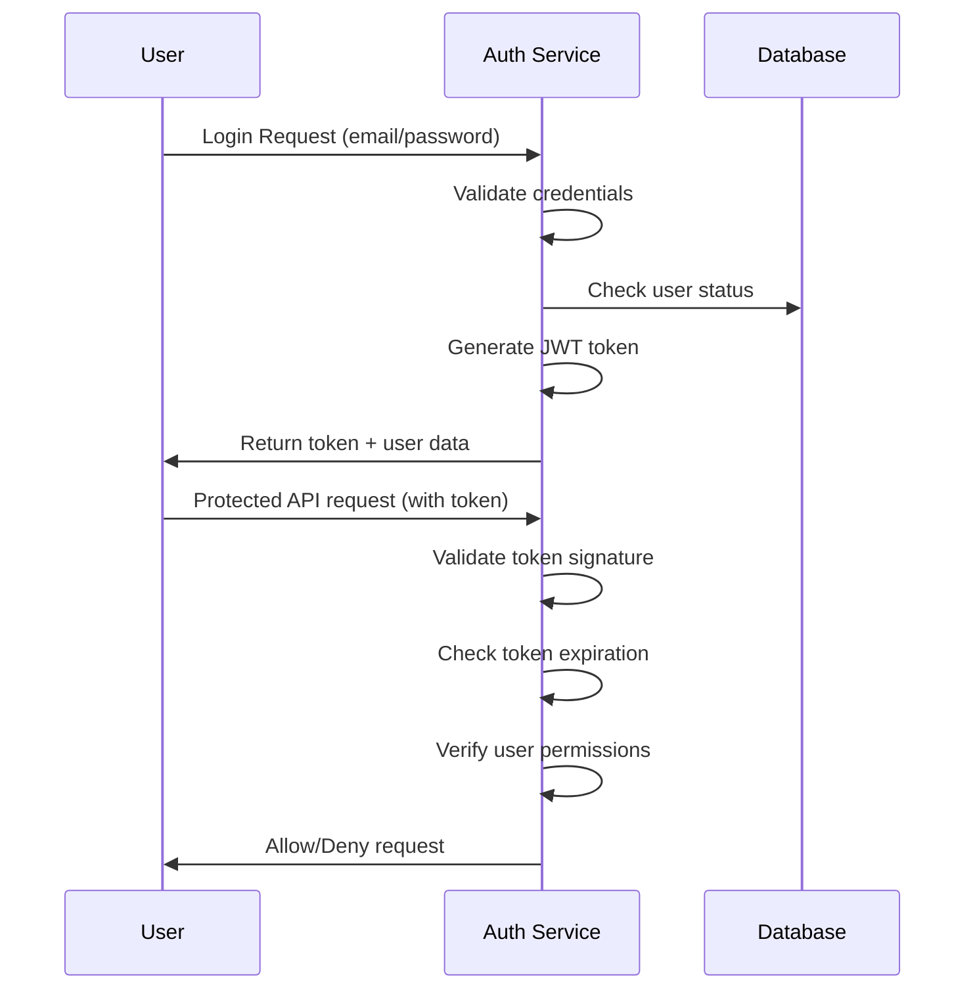

# Teto-Egen Security Architecture Document

## Executive Summary

This document outlines the comprehensive security architecture for the Teto-Egen Personality Test Web App, ensuring protection of user data, assessment integrity, and platform availability. The architecture follows industry best practices including SOC 2 Type II compliance, GDPR/CCPA compliance, and Zero Trust principles.

## Security Objectives

### Primary Goals
1. **Data Protection**: Safeguard user personal information and assessment data
2. **Privacy Compliance**: Meet GDPR, CCPA, and other global privacy regulations
3. **System Integrity**: Ensure assessment accuracy and platform reliability
4. **Availability**: Maintain 99.9% uptime with disaster recovery capabilities
5. **Access Control**: Implement least-privilege access with strong authentication

### Risk Tolerance
- **Data Breach**: Maximum acceptable loss <$100K
- **Downtime**: Maximum acceptable outage <4 hours annually
- **Compliance Violation**: Zero tolerance for regulatory violations

## Security Framework

### Compliance Standards
- **SOC 2 Type II**: Security, Availability, Confidentiality, Processing Integrity
- **GDPR**: EU user data protection and privacy
- **CCPA**: California consumer privacy rights
- **ISO 27001**: Information security management
- **NIST CSF**: Cybersecurity framework alignment

### Security Principles
1. **Defense in Depth**: Multiple layers of security controls
2. **Zero Trust**: Never trust, always verify
3. **Least Privilege**: Minimal access necessary for functions
4. **Privacy by Design**: Data protection built into every component
5. **Continuous Monitoring**: Real-time threat detection and response

## Data Classification & Handling

### Data Categories

#### 1. Personal Identifiable Information (PII)
- **Examples**: Email, name, IP address, device information
- **Handling**: Encrypted at rest and in transit, minimal retention
- **Access**: Role-based access, audit logging
- **Retention**: 7 years or until user deletion request

#### 2. Personality Assessment Data
- **Examples**: Assessment responses, personality results, behavioral insights
- **Handling**: End-to-end encryption, pseudonymization
- **Access**: User only, with explicit consent for sharing
- **Retention**: Until user deletion request

#### 3. Behavioral Analytics Data
- **Examples**: Session data, interaction patterns, feature usage
- **Handling**: Aggregated anonymization, encryption
- **Access**: Analytics team, product team (aggregated only)
- **Retention**: 2 years for product improvement

#### 4. System Operational Data
- **Examples**: Logs, metrics, monitoring data
- **Handling**: Encryption, access control
- **Access**: Operations, security teams
- **Retention**: 90 days for operational, 7 years for audit

## Infrastructure Security

### Network Architecture

#### Zero Trust Network Model
```
Internet
   │
[CDN/WAF] ←→ [Load Balancer]
   │              │
   │        [API Gateway]
   │              │
   │        [Microservices]
   │        ┌─────┴─────┐
   │        │           │
[Web UI] [Auth Service] [Analytics]
   │        │           │
   └────[VPN/Privileged Access]────┘
            │
      [Admin Panel]
```

#### Network Segmentation
- **Public Zone**: Web UI, public APIs
- **Private Zone**: Internal services, databases
- **DMZ**: Edge services, caching layers
- **Admin Zone**: Management interfaces, privileged access

#### Security Controls
- **Firewalls**: Network ACLs, host-based firewalls
- **Intrusion Detection**: Network and host-based IDS
- **DDoS Protection**: Rate limiting, traffic filtering
- **VPC Peering**: Secure service-to-service communication

### Cloud Security

#### Cloud Provider: AWS
- **Regions**: Primary in us-east-1, backup in us-west-2
- **Availability Zones**: Multi-AZ deployment for all services
- **Compliance**: AWS SOC, PCI DSS, ISO certifications

#### Security Services
- **AWS WAF**: Web application firewall
- **AWS Shield**: DDoS protection
- **AWS Inspector**: Vulnerability assessment
- **AWS Config**: Configuration compliance monitoring
- **CloudTrail**: Audit logging for all API calls

## Application Security

### Authentication & Authorization

#### Identity Management
- **User Authentication**: Email/password or OAuth (Google, LinkedIn)
- **Multi-Factor Authentication**: Optional for all, required for admin
- **Password Policy**: Minimum 12 characters, complexity requirements
- **Session Management**: JWT tokens with 15-minute refresh

#### Authorization Model
- **RBAC**: Role-based access control
- **ABAC**: Attribute-based access control for data
- **Privileges**:
  - **User**: Own data access only
  - **Premium**: Extended features access
  - **Admin**: Platform management
  - **Super Admin**: System configuration

#### Authentication Flow


### Data Encryption

#### Encryption at Rest
- **Database**: AWS KMS encryption for all data
- **Files**: AES-256 encryption for any stored files
- **Backups**: Encrypted with separate keys
- **Key Management**: AWS KMS with customer master keys

#### Encryption in Transit
- **HTTPS**: TLS 1.3 for all external communications
- **Internal Services**: Mutual TLS (mTLS) for service-to-service
- **APIs**: OAuth 2.0 with PKCE for third-party integrations
- **Admin Access**: VPN with certificate-based authentication

### API Security

#### REST API Security
- **Authentication**: JWT Bearer tokens
- **Rate Limiting**: 1000 requests/hour per user
- **Input Validation**: Schema validation, sanitization
- **Output Encoding**: Prevent XSS, injection attacks
- **CORS**: Restricted to approved domains only

#### GraphQL Security
- **Query Complexity**: Maximum depth and cost limits
- **Field-Level Permissions**: Granular access control
- **Introspection**: Disabled in production
- **Batching**: Request batching with limits

## Data Protection

### Privacy by Design

#### Data Minimization
- **Collection**: Only essential data for assessment
- **Processing**: Pseudonymization of assessment data
- **Storage**: Separation of identity and behavioral data
- **Sharing**: Explicit user consent required

#### User Rights Implementation
- **Right to Access**: Self-service data download
- **Right to Rectification**: User profile editing
- **Right to Erasure**: Complete data deletion upon request
- **Right to Portability**: JSON export of user data
- **Right to Object**: Opt-out of non-essential processing

### Consent Management

#### Consent Framework
- **Granular Consent**: Separate consent for different data uses
- **Clear Purpose**: Specific, legitimate purposes for data use
- **Easy Withdrawal**: One-click consent withdrawal
- **Audit Trail**: Record of all consent actions

#### Consent Types
1. **Assessment Participation**: Required for service use
2. **Marketing Communications**: Optional, easily withdrawable
3. **Research Participation**: Optional, with clear benefits
4. **Third-party Sharing**: Optional, specific partners only

### Data Breach Response

#### Incident Response Plan
1. **Detection**: Continuous monitoring, anomaly detection
2. **Containment**: Isolate affected systems, disable compromised accounts
3. **Investigation**: Determine scope, root cause, data impacted
4. **Notification**: Users, regulators, stakeholders within 72 hours
5. **Recovery**: Restore systems, verify data integrity
6. **Post-mortem**: Lessons learned, process improvements

#### Breach Classification
- **Tier 1**: PII exposure affecting >1000 users (72-hour notification)
- **Tier 2**: PII exposure affecting <1000 users (7-day notification)
- **Tier 3**: System compromise without PII exposure (internal)

## Vulnerability Management

### Security Testing

#### Static Application Security Testing (SAST)
- **Tools**: SonarQube, ESLint security plugins
- **Frequency**: Per commit in CI/CD pipeline
- **Coverage**: 100% of application code
- **Remediation**: High severity issues block deployment

#### Dynamic Application Security Testing (DAST)
- **Tools**: OWASP ZAP, Burp Suite Professional
- **Frequency**: Weekly automated scans
- **Scope**: All public endpoints and APIs
- **Reporting**: Integration with issue tracking system

#### Penetration Testing
- **Internal**: Quarterly internal security team testing
- **External**: Annual third-party penetration testing
- **Scope**: Full application stack and infrastructure
- **Remediation**: 90-day SLA for critical vulnerabilities

### Vulnerability Management Process

#### Risk Assessment
- **Severity Scoring**: CVSS v3.1 scoring system
- **Business Impact**: User impact, regulatory risk, reputation
- **Remediation Priority**: Business criticality, exploitability

#### Patch Management
- **Critical Patches**: Within 72 hours of release
- **High Severity**: Within 30 days
- **Medium Severity**: Within 90 days
- **Low Severity**: Within 180 days

## Monitoring & Logging

### Security Monitoring

#### Real-time Threat Detection
- **SIEM**: AWS Security Hub + third-party SIEM
- **User Behavior Analytics**: Anomalous login patterns
- **Network Monitoring**: Unusual traffic patterns
- **Log Analysis**: Suspicious activity detection

#### Alerting System
- **Severity Levels**: Critical, High, Medium, Low
- **Response Times**:
  - Critical: 15 minutes acknowledgment
  - High: 1 hour acknowledgment
  - Medium: 4 hours acknowledgment
  - Low: 24 hours acknowledgment
- **Escalation**: Automatic escalation after SLA breach

### Audit Logging

#### Log Categories
- **Authentication Logs**: All login attempts, MFA events
- **Authorization Logs**: Access requests, permission changes
- **Data Access Logs**: Read/write operations on sensitive data
- **System Logs**: Application errors, performance issues
- **Security Logs**: Firewall blocks, IDS alerts

#### Log Retention
- **Security Logs**: 7 years (compliance requirement)
- **Operational Logs**: 90 days (performance analysis)
- **Debug Logs**: 30 days (troubleshooting)
- **Audit Trail**: Permanent (user data access)

## Disaster Recovery & Business Continuity

### Backup Strategy

#### Data Backup
- **Frequency**: Daily full backups, hourly incremental
- **Storage**: Encrypted backups in separate region
- **Retention**: 30 days of daily backups, 365 days monthly
- **Testing**: Monthly restore testing to verify integrity

#### System Backup
- **Configuration**: Infrastructure as Code (Terraform)
- **Application Code**: Version controlled in Git
- **Database Schema**: Migrations with version control
- **Environment Variables**: Secure parameter store

### Disaster Recovery Plan

#### Recovery Point Objective (RPO)
- **Critical Data**: 1 hour
- **Application State**: 24 hours
- **Archived Data**: 30 days

#### Recovery Time Objective (RTO)
- **Critical Services**: 4 hours
- **Standard Services**: 24 hours
- **Archived Services**: 7 days

#### Failover Process
1. **Detection**: Automated health checks every 5 minutes
2. **Notification**: Alert on-call team within 15 minutes
3. **Activation**: Manual or automatic failover to backup region
4. **Verification**: Service health checks in backup environment
5. **Communication**: Status updates to stakeholders and users

## Third-party Security

### Vendor Management

#### Security Assessment
- **Due Diligence**: Security questionnaire, SOC 2 reports
- **Ongoing Monitoring**: Annual security reviews
- **Contract Terms**: Security requirements, incident notification
- **Access Control**: Principle of least privilege

#### Critical Vendors
- **Cloud Provider**: AWS (SOC 2, ISO 27001 certified)
- **Payment Processor**: Stripe (PCI DSS compliant)
- **Email Service**: SendGrid (SOC 2 Type II compliant)
- **Analytics**: Google Analytics (Privacy Shield certified)

### Supply Chain Security

#### Code Dependencies
- **Scanning**: Snyk or similar for vulnerability scanning
- **Approval Process**: Security review for new dependencies
- **Version Pinning**: Specific versions in package.json
- **Regular Updates**: Monthly dependency review and updates

#### Container Security
- **Image Scanning**: Trivy or Clair for vulnerability detection
- **Runtime Security**: Falco for runtime threat detection
- **Access Control**: Kubernetes RBAC for container orchestration
- **Network Policies**: Container-to-container communication control

## Compliance & Governance

### Privacy Compliance

#### GDPR Implementation
- **Data Processing Agreement**: With all subprocessors
- **Privacy Impact Assessment**: For new features
- **Data Protection Officer**: Appointed for GDPR compliance
- **Breach Notification**: Within 72 hours to regulators

#### CCPA Implementation
- **Do Not Sell**: Opt-out mechanism for data sharing
- **Access Requests**: 45-day response time
- **Deletion Requests**: Complete data removal
- **Notice at Collection**: Clear disclosure of data use

### Security Governance

#### Security Committee
- **Members**: CTO, Security Lead, Legal, Privacy Officer
- **Meetings**: Monthly security reviews
- **Reporting**: Quarterly security metrics to board
- **Budget**: Dedicated security budget allocation

#### Security Training
- **Development Team**: Secure coding practices, quarterly training
- **Operations Team**: Security operations, incident response
- **All Employees**: Annual security awareness training
- **Third Parties**: Security requirements in contracts

## Risk Assessment

### Threat Modeling

#### STRIDE Model Application
- **Spoofing**: Strong authentication, MFA
- **Tampering**: Data integrity checks, input validation
- **Repudiation**: Comprehensive audit logging
- **Information Disclosure**: Encryption, access controls
- **Denial of Service**: Rate limiting, DDoS protection
- **Elevation of Privilege**: RBAC, principle of least privilege

#### Top Security Risks
1. **Data Breach**: Compromise of user assessment data
2. **Account Takeover**: Unauthorized access to user accounts
3. **API Abuse**: Excessive requests, data scraping
4. **Insider Threat**: Malicious or negligent employee actions
5. **Supply Chain Attack**: Compromised third-party dependencies

### Risk Mitigation Strategies

#### High Priority Risks
- **Data Breach**: Encryption, access controls, incident response
- **Account Takeover**: MFA, suspicious login detection, CAPTCHA
- **API Abuse**: Rate limiting, API keys, request validation

#### Medium Priority Risks
- **Insider Threat**: Monitoring, job rotation, access reviews
- **Supply Chain Attack**: Dependency scanning, vendor assessment

## Implementation Roadmap

### Phase 1: Foundation Security (Months 1-3)
- Implement authentication system
- Set up encryption at rest and in transit
- Establish basic monitoring and logging
- Complete initial security assessment

### Phase 2: Advanced Security (Months 4-6)
- Deploy comprehensive security testing
- Implement advanced monitoring and alerting
- Complete penetration testing
- Establish incident response procedures

### Phase 3: Compliance & Optimization (Months 7-12)
- Achieve SOC 2 Type II certification
- Implement privacy compliance measures
- Optimize security controls based on metrics
- Conduct security training for all teams

## Security Metrics & KPIs

### Operational Metrics
- **Mean Time to Detect (MTTD)**: Target <1 hour
- **Mean Time to Respond (MTTR)**: Target <4 hours
- **Vulnerability Remediation Rate**: >95% within SLA
- **Security Incident Count**: <5 per quarter

### Compliance Metrics
- **Audit Findings**: Zero critical findings
- **Policy Violations**: <1% of access requests
- **Training Completion**: 100% of employees annually
- **Compliance Score**: >95% across all frameworks

### Business Metrics
- **Security Investment ROI**: Reduced incident costs
- **Customer Trust Score**: Based on security perception surveys
- **Vendor Security Score**: Third-party security ratings
- **Regulatory Fines**: Zero non-compliance penalties

---

**Document Version**: 1.0
**Created**: November 6, 2025
**Next Review**: February 6, 2026
**Security Lead**: [Security Lead Name]
**Compliance Officer**: [Compliance Officer Name]