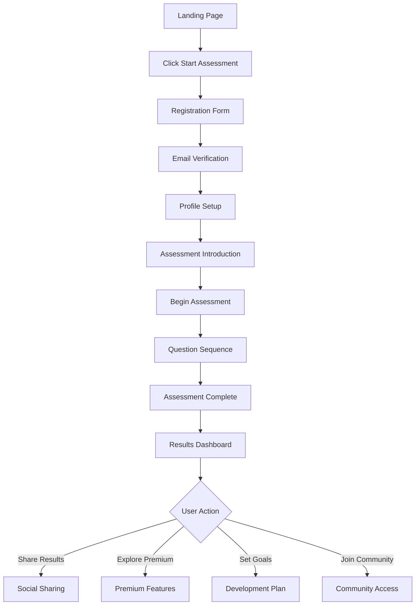
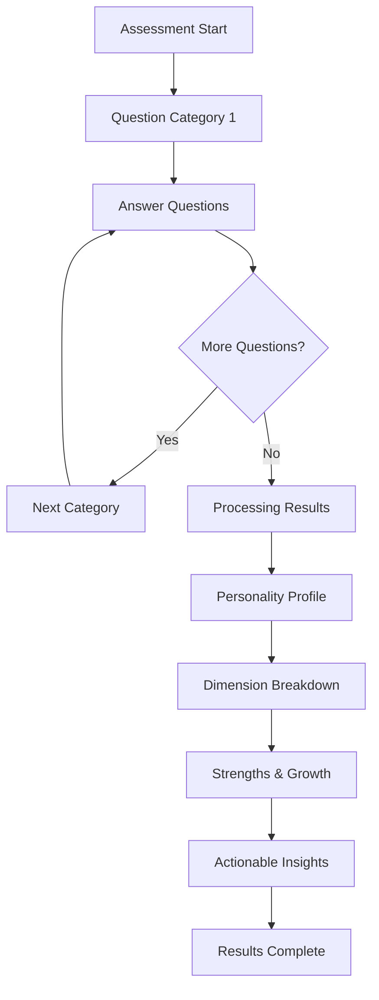
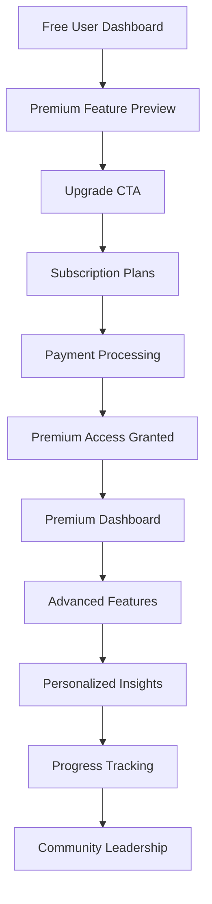
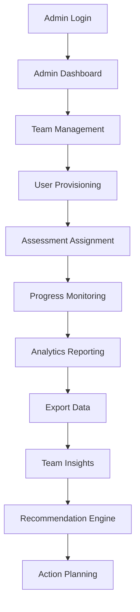

# Teto-Egen User Flows & Journey Maps

## Executive Summary

This document details the comprehensive user flows and journey maps for the Teto-Egen Personality Test Web App, covering all primary and secondary user paths from initial awareness through long-term engagement. The flows are designed to optimize conversion, retention, and user satisfaction while supporting both individual users and enterprise clients.

## User Personas & Journey Stages

### Primary User Personas

#### 1. Career Development Seeker (Sarah)
- **Demographics**: 28, marketing professional, 3 years experience
- **Goals**: Career advancement, skill development, workplace fit
- **Pain Points**: Unclear career direction, difficult workplace relationships
- **Technology Comfort**: High, frequent social media user, comfortable with apps

#### 2. Self-Improvement Enthusiast (Michael)
- **Demographics**: 22, college student, psychology major
- **Goals**: Personal growth, relationship improvement, self-awareness
- **Pain Points**: Understanding personal patterns, communication issues
- **Technology Comfort**: Very high, tech-savvy, early adopter

#### 3. HR Professional (Jennifer)
- **Demographics**: 35, HR director, 10+ years experience
- **Goals**: Team building, hiring decisions, employee development
- **Pain Points**: Team conflicts, poor hiring decisions, low engagement
- **Technology Comfort**: High, familiar with HR tech platforms

## User Journey Maps

### 1. Career Development Seeker Journey

#### Stage 1: Awareness (0-7 days)
**Touchpoints**:
- LinkedIn post about career development
- Google search "personality test for career"
- Friend recommendation on social media

**Goals**:
- Discover new career insights
- Find tools for professional growth
- Validate career choices

**Actions**:
- Click on social media content
- Search for personality tests
- Visit Teto-Egen landing page

**Emotions**:
- Curiosity about career options
- Frustration with current position
- Hope for new opportunities

#### Stage 2: Consideration (1-14 days)
**Touchpoints**:
- Teto-Egen website
- Comparison with other platforms
- Email newsletter signup

**Goals**:
- Evaluate platform credibility
- Understand assessment process
- Determine value proposition

**Actions**:
- Read about Teto-Egen methodology
- Compare with 16Personalities
- Sign up for email updates

**Emotions**:
- Skepticism about accuracy
- Interest in scientific approach
- Trust building

#### Stage 3: Conversion (1-7 days)
**Touchpoints**:
- Landing page
- Email nurture sequence
- Social proof elements

**Goals**:
- Complete personality assessment
- Receive actionable insights
- Validate career recommendations

**Actions**:
- Create account
- Start assessment
- Complete all questions
- View results

**Emotions**:
- Engagement with questions
- Anticipation of results
- Satisfaction with insights

#### Stage 4: Activation (0-30 days)
**Touchpoints**:
- Results dashboard
- Email follow-up
- Premium feature recommendations

**Goals**:
- Understand personality profile
- Apply insights to career
- Explore growth opportunities

**Actions**:
- Review detailed results
- Read career recommendations
- Set development goals
- Consider premium upgrade

**Emotions**:
- Validation of self-perception
- Excitement about possibilities
- Motivation for action

#### Stage 5: Retention (30+ days)
**Touchpoints**:
- Weekly insights emails
- Growth plan reminders
- Community features

**Goals**:
- Track personal development
- Continue learning about personality
- Connect with similar types

**Actions**:
- Use growth tools
- Share results with friends
- Join community discussions
- Upgrade to premium

**Emotions**:
- Commitment to growth
- Community belonging
- Continued value realization

### 2. Self-Improvement Enthusiast Journey

#### Stage 1: Awareness (0-3 days)
**Touchpoints**:
- TikTok personality content
- Psychology subreddit
- University psychology club

**Goals**:
- Learn about personality psychology
- Find self-assessment tools
- Connect with like-minded individuals

**Actions**:
- Watch personality videos
- Read psychology articles
- Visit Teto-Egen website

**Emotions**:
- Intellectual curiosity
- Desire for self-understanding
- Excitement about psychology

#### Stage 2: Consideration (3-10 days)
**Touchpoints**:
- Detailed website exploration
- Academic research comparison
- Peer discussions

**Goals**:
- Validate scientific credibility
- Understand methodology
- Assess depth of insights

**Actions**:
- Read methodology documentation
- Check academic references
- Compare with Big Five assessments

**Emotions**:
- Analytical evaluation
- Academic interest
- Critical assessment

#### Stage 3: Conversion (1-5 days)
**Touchpoints**:
- Assessment introduction page
- Scientific validation content
- Quick start option

**Goals**:
- Experience the assessment
- Validate scientific approach
- Receive comprehensive insights

**Actions**:
- Begin assessment
- Engage with question logic
- Complete evaluation
- Review results depth

**Emotions**:
- Intellectual engagement
- Satisfaction with depth
- Curiosity about accuracy

#### Stage 4: Activation (0-30 days)
**Touchpoints**:
- Detailed results page
- Personalized recommendations
- Growth plan setup

**Goals**:
- Apply insights to relationships
- Set personal development goals
- Track progress over time

**Actions**:
- Explore relationship dynamics
- Create development plan
- Set weekly goals
- Track habit formation

**Emotions**:
- Self-discovery satisfaction
- Motivation for improvement
- Connection to insights

#### Stage 5: Retention (30+ days)
**Touchpoints**:
- Progress tracking dashboard
- Community engagement features
- Advanced insights content

**Goals**:
- Maintain growth momentum
- Deepen self-understanding
- Share insights with others

**Actions**:
- Track development progress
- Participate in community
- Access advanced content
- Recommend to friends

**Emotions**:
- Commitment to growth
- Community connection
- Continued learning excitement

### 3. HR Professional Journey

#### Stage 1: Awareness (0-14 days)
**Touchpoints**:
- HR industry publications
- Conference presentations
- LinkedIn HR groups

**Goals**:
- Discover employee assessment tools
- Evaluate team development solutions
- Find data-driven HR approaches

**Actions**:
- Read industry articles
- Attend webinars
- Research assessment platforms

**Emotions**:
- Professional curiosity
- Need for better tools
- Budget consciousness

#### Stage 2: Consideration (14-30 days)
**Touchpoints**:
- Product demos
- Case studies
- Peer recommendations

**Goals**:
- Evaluate platform capabilities
- Understand ROI potential
- Assess implementation complexity

**Actions**:
- Request product demo
- Review case studies
- Compare with competitors
- Calculate potential benefits

**Emotions**:
- Analytical evaluation
- Decision pressure
- Organizational responsibility

#### Stage 3: Conversion (7-21 days)
**Touchpoints**:
- Custom demo session
- Pilot program setup
- Contract negotiation

**Goals**:
- Implement pilot program
- Train HR team
- Integrate with existing systems

**Actions**:
- Schedule implementation
- Set up pilot group
- Configure team analytics
- Train administrators

**Emotions**:
- Implementation focus
- Team coordination
- Success anticipation

#### Stage 4: Activation (30-90 days)
**Touchpoints**:
- Admin dashboard
- Team analytics reports
- Support resources

**Goals**:
- Deploy to organization
- Monitor team effectiveness
- Measure impact on performance

**Actions**:
- Roll out to employees
- Review team analytics
- Generate reports
- Provide feedback

**Emotions**:
- Organizational impact focus
- Data-driven decision making
- Performance measurement

#### Stage 5: Retention (90+ days)
**Touchpoints**:
- Quarterly business reviews
- Advanced feature adoption
- Renewal discussions

**Goals**:
- Maximize platform value
- Expand to other departments
- Justify continued investment

**Actions**:
- Use advanced analytics
- Expand user base
- Integrate with other systems
- Plan for renewal

**Emotions**:
- Strategic business focus
- Value realization
- Future planning

## Core User Flows

### Flow 1: New User Registration & Assessment

#### Entry Points
1. Landing page CTA
2. Social media referral
3. Email campaign
4. Content marketing article

#### Step-by-Step Flow
1. **Landing Page Visit**
   - View value proposition
   - See social proof
   - Click "Start Free Assessment"

2. **Registration Process**
   - Enter email and password
   - Accept terms and privacy policy
   - Verify email address (optional)
   - Complete profile (name, optional demographics)

3. **Assessment Introduction**
   - View assessment overview
   - Understand time commitment
   - Read privacy assurances
   - Begin assessment

4. **Assessment Experience**
   - Answer personality questions
   - Progress through sections
   - Save progress option
   - Complete all questions

5. **Results Presentation**
   - View personality type
   - See dimension breakdowns
   - Read strengths and growth areas
   - Access detailed report

6. **Post-Assessment Actions**
   - Share results (social, email)
   - Explore premium features
   - Set development goals
   - Join community

#### Success Metrics
- Registration completion rate: 85%+
- Assessment start rate: 95%+
- Assessment completion rate: 75%+
- Results view rate: 90%+

### Flow 2: Returning User Engagement

#### Entry Points
1. Email notification
2. Direct website visit
3. Mobile app notification
4. Community invitation

#### Step-by-Step Flow
1. **Authentication**
   - Login with credentials
   - Multi-factor authentication (if enabled)
   - Session restoration

2. **Dashboard Overview**
   - View recent activity
   - See progress updates
   - Check community notifications
   - Access saved content

3. **Personal Development**
   - Review growth plan
   - Track habit formation
   - Update goals
   - Access new insights

4. **Community Interaction**
   - View type-specific discussions
   - Participate in surveys
   - Share experiences
   - Connect with similar users

5. **Premium Feature Access**
   - Explore advanced analytics
   - Access career tools
   - Use relationship insights
   - Compare with others

#### Success Metrics
- Daily active users: 40%+
- Feature adoption rate: 60%+
- Community participation: 25%+
- Premium conversion: 15%+

### Flow 3: Enterprise User Onboarding

#### Entry Points
1. Sales contact
2. Website enterprise inquiry
3. Industry referral
4. Conference meeting

#### Step-by-Step Flow
1. **Initial Contact**
   - Submit enterprise inquiry
   - Receive sales follow-up
   - Schedule discovery call
   - Review use cases

2. **Solution Presentation**
   - Product demonstration
   - Custom requirements discussion
   - Integration assessment
   - Pricing proposal

3. **Contract & Setup**
   - Agreement finalization
   - Account provisioning
   - Admin training
   - Data privacy review

4. **Pilot Implementation**
   - Select pilot group
   - Configure assessments
   - Set up reporting
   - Monitor initial usage

5. **Full Rollout**
   - Organization-wide deployment
   - User communication
   - Ongoing support
   - Success measurement

#### Success Metrics
- Pilot completion rate: 90%+
- Full rollout adoption: 80%+
- Admin satisfaction: 90%+
- Renewal rate: 95%+

## Detailed User Flow Diagrams

### User Registration Flow

### Assessment Experience Flow

### Premium Upgrade Flow

### Enterprise Admin Flow

## Cross-Platform User Flows

### Mobile-First Experience
1. **Progressive Onboarding**
   - Simplified registration
   - Quick assessment start
   - Just-in-time explanations
   - Thumb-friendly navigation

2. **Offline Capabilities**
   - Assessment progress saving
   - Local results caching
   - Sync when online
   - Push notification reminders

3. **Mobile-Specific Features**
   - Camera integration for avatars
   - Native sharing options
   - Push notifications
   - Biometric authentication

### Web Application Experience
1. **Enhanced Visualization**
   - Interactive radar charts
   - Detailed comparison tools
   - Comprehensive reporting
   - Advanced analytics

2. **Multi-Window Workflow**
   - Results alongside recommendations
   - Side-by-side comparisons
   - Research integration
   - Print/PDF export

### API Integration Flows
1. **Third-Party Authentication**
   - OAuth integration
   - SSO support
   - LDAP compatibility
   - SCIM provisioning

2. **Data Exchange**
   - RESTful API access
   - GraphQL subscriptions
   - Webhook notifications
   - Bulk data export

## Accessibility User Flows

### Screen Reader Experience
1. **Semantic HTML Structure**
   - Proper heading hierarchy
   - ARIA labels and roles
   - Keyboard navigation
   - Focus management

2. **Alternative Text**
   - Descriptive image alt text
   - Chart data tables
   - Icon meaning descriptions
   - Color contrast information

### Keyboard Navigation
1. **Tab Order**
   - Logical flow sequence
   - Skip link navigation
   - Focus indicators
   - Escape key functionality

2. **Shortcuts**
   - Common action shortcuts
   - Navigation accelerators
   - Form submission keys
   - Help access

## Error Handling Flows

### Authentication Errors
1. **Invalid Credentials**
   - Clear error messaging
   - Password reset option
   - Account recovery process
   - Multi-factor fallback

2. **Session Expiration**
   - Auto-save mechanism
   - Graceful timeout warning
   - Resume capability
   - Progress preservation

### System Errors
1. **Service Unavailable**
   - User-friendly messaging
   - Estimated downtime
   - Alternative contact methods
   - Status page integration

2. **Data Processing Errors**
   - Error reporting mechanism
   - Retry options
   - Manual intervention paths
   - Support escalation

## User Feedback Integration

### In-App Feedback Loops
1. **Real-time Satisfaction**
   - Results accuracy rating
   - Feature usefulness scores
   - Quick feedback buttons
   - NPS surveys

2. **Behavioral Analytics**
   - Feature adoption tracking
   - Drop-off point analysis
   - Completion rate monitoring
   - User path optimization

### Continuous Improvement
1. **A/B Testing Framework**
   - UI element variations
   - Content messaging tests
   - Flow optimization
   - Conversion rate experiments

2. **User Research Integration**
   - Regular user interviews
   - Usability testing sessions
   - Feature request prioritization
   - Roadmap alignment

## Success Metrics by Flow

### Registration & Assessment Flow
- **Completion Rate**: 75% minimum
- **Drop-off Points**: <5% at any single step
- **Average Time**: 12 minutes for assessment
- **Accuracy Rating**: 4.5+/5.0 user satisfaction

### Engagement & Retention Flow
- **Weekly Active Users**: 40%+ of total users
- **Feature Adoption**: 60%+ premium feature trial
- **Community Participation**: 25%+ discussion engagement
- **Premium Conversion**: 15%+ upgrade rate

### Enterprise Implementation Flow
- **Pilot Success**: 90%+ completion rate
- **Full Deployment**: 80%+ organizational adoption
- **Admin Satisfaction**: 4.5+/5.0 rating
- **Renewal Rate**: 95%+ annual retention

## Future State Flows

### AI-Powered Personalization
1. **Adaptive Assessment**
   - Dynamic question selection
   - Real-time difficulty adjustment
   - Branching logic optimization
   - Response pattern analysis

2. **Predictive Insights**
   - Career trajectory modeling
   - Growth opportunity identification
   - Relationship compatibility forecasting
   - Skill development recommendations

### Cross-Platform Integration
1. **Ecosystem Partnerships**
   - LinkedIn profile integration
   - Calendar scheduling sync
   - Learning platform connections
   - Wellness app integrations

2. **IoT & Wearable Integration**
   - Biometric correlation analysis
   - Stress pattern identification
   - Energy level tracking
   - Behavioral pattern recognition

---

**Document Version**: 1.0
**Created**: November 6, 2025
**Next Review**: December 6, 2025
**UX Lead**: [UX Lead Name]
**Product Manager**: [Product Manager Name]